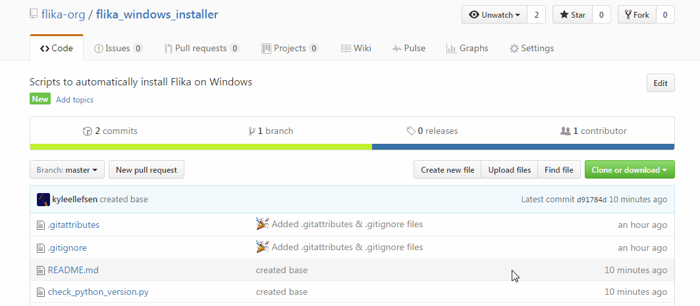
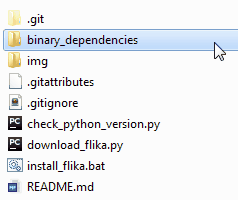

## Flika ##
### How to install Flika on Windows ###

####1. Install Python How to install Flika on Windows. ####
This installer only works with Python 3.5. Install Python 3.5. To install Python, go [here](https://www.python.org/downloads/windows/) and download the 3.5 Windows x86-64 MSI installer.  Once the file is downloaded, double click the icon and follow the on-screen instructions.


####2. Download this repository from Github.  ####



####3. (optional) Set up virtual environment.  ####
If you want to use a Python virtual environment, open a command prompt, navigate to the newly downloaded folder, and run the following commands

	```
	python -m venv .
	Scripts\activate.bat
	```

####4. Run the install_flika.bat file.  ####
The install should take <7 minutes.

